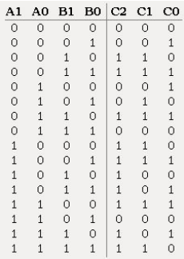
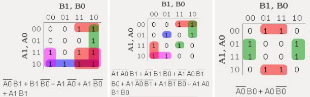
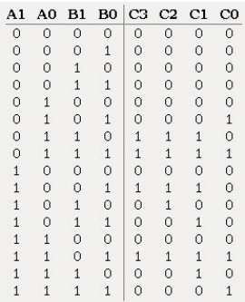
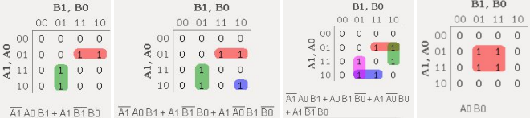
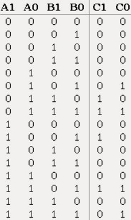
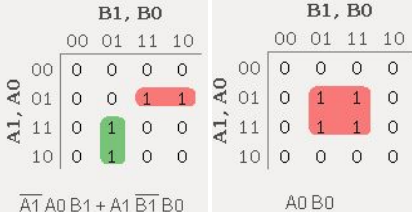
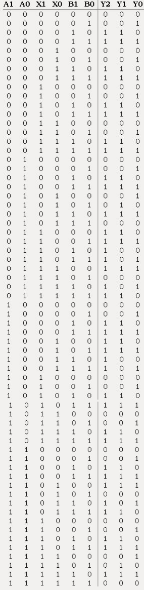
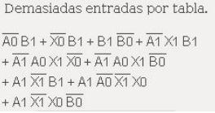

# Tarea 1

## Herramientas necesarias

Se ha comprobado el correcto funcionamiento del proyecto con las siguientes versiones:
- Logisim 2.7.1

## Uso

1. Ejecute el software Logisim
2. Vaya a la pestaña "File" y seleccione la opción "Open"
3. Seleccione el circuito que desea ver y realice las operaciones del circuito presionando sobre las casillas. Las casillas A1 y A0 corresponden al primer número, donde A1 es el bit de mayor valor; B1 y B0 corresponden al segundo número, donde B1 es el bit de mayor valor; y C es el resultado

## Descripción

Para esta tarea se solicitó la creación de distintos circuitos, encargados de:
- Realizar la adición y multiplicación entre dos entradas enteras de 2 bits
- Determinar el valor de y = ax + b, donde a, x, b son entradas enteras de 2 bits

Lo primero que se hizo fue considerar los números enteros posibles con un tamaño de 2 bits. Si los analizamos en complemento-2, el rango de los números que se pueden representar es [-2, 1].

| Decimal  | Binario  |
|----------|----------|
|   -2     |   10     |
|   -1     |   11     |
|   0      |   00     |
|   1      |   01     |

Posteriormente se desarrollaron las tablas de verdad de cada caso, y así poder conocer los resultados posibles bajo cada operación. Luego, para la simplificación de los circuitos, se hicieron mapas de Karnaugh por cada bit de salida, para finalmente simular su funcionamiento y representarlos de forma gráfica en el software Logisim.

### Circuito suma

El rango de resultados obtenidos a partir de la suma entre dos enteros de 2 bits sólo es posible de representar con una salida de 3 bits como mínimo. Su tabla de verdad, donde los sumandos son A1A0 y B1B0, y C2C1C0 es el resultado, queda representada por:

Luego de haber realizado los mapas de Karnaugh, el circuito generado ha sido guardado en el archivo `suma.circ`

### Circuito multiplicación

Para realizar este circuito se decidió que la salida fuera de 4 bits, para así poder representar todo el rango de números que se pudiera obtener en una multiplicación con dos entradas de 2 bits. La tabla de verdad asociada, donde A1 y A0 representan al primer número, B1 y B0 al segundo número, y C3, C2, C1 y C0 al resultado de la operación, queda:

Luego de haber realizado los mapas de Karnaugh, el circuito generado ha sido guardado en el archivo `multi4bits.circ`

### Circuito ecuación y = ax + b

Debido a que para este circuito la multiplicación de ‘ax’ debe entregar un entero de dos bits, el circuito de multiplicación original (de 4 bits) no es aplicable, por lo que se diseñó uno nuevo, cuya tabla de verdad se ilustra a continuación:

Generando el circuito guardado en el archivo `multi2bits.circ`

Luego, se deben fusionar las operaciones de multiplicación y suma. Debido a que esta tabla y sus mapas de Karnaugh asociados son muy tediosos, se optó por unir los circuitos ya diseñados, obteniendo el archivo `ecuacion.circ`

