# Tarea 2

## Herramientas necesarias

Se ha comprobado el correcto funcionamiento del proyecto con las siguientes versiones:
- JFLAP 7.1
- Logisim 2.7.1

## Uso

1. Ejecute el software Logisim
2. Vaya a la pestaña "File" y seleccione la opción "Open"
3. Seleccione el circuito que desea ver y realice las operaciones del circuito presionando sobre las casillas

## Descripción

Para esta tarea se solicitó la creación de distintos circuitos, encargados de:
- Mediante dos entradas (A, B), identificar cuando |A| mod 4 = |B| mod 4, es decir, que la cantidad de A módulo 4 sea igual a la cantidad de B módulo 4
- Utilizando una máquina de estados finitos (FSM), identificar la secuencia 10110 con traslape de la misma secuencia

Para cada ejercicio se realizó la máquina de estados finitos solicitada utilizando la herramienta JFLAP y se procedió a codificar cada estado donde su número fue representado en notación decimal, para luego crear la tabla de verdad de estados de entrada y salida, los mapas de Karnaugh asociados y finalmente el circuito generado a partir de esta información con Logisim.

### Circuito Módulo 4

Para este circuito se diseñó la siguiente máquina de estados finitos:
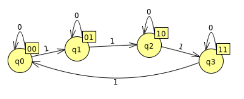

Donde:
Conjunto de Estados: {q0, q1, q2, q3}
Estado inicial: q0
Alfabeto de entrada: {0, 1}
Alfabeto de salida: {00, 01, 10, 11}
Salidas: Cuadros de texto ubicados en el extremo superior derecho de cada estado
Transiciones: Flecha, indicando el sentido y el valor necesario para que ésta se realice

Con esta información, se creó la siguiente tabla de transiciones:

| Estado   | Alfabeto de salida   | Entrada: 0 | Entrada: 1   | 
|----------|----------------------|------------|--------------|
|   q0     |          00          |   q0       |     q1       |
|   q1     |          01          |   q1       |     q2       |
|   q2     |          10          |   q2       |     q3       |
|   q3     |          11          |   q3       |     q0       |

Y luego se codificó cada etiqueta de estado en notación decimal:

| Estado | E1 E0 |
|--------|-------|
| q0     |  0 0  |
| q1     |  0 1  |
| q2     |  1 0  |
| q3     |  1 1  |

Por lo que se obtiene la siguiente tabla de verdad, donde E1 E0 son los estados codificados y O1 O0 son sus alfabetos de salida:

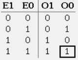

Y sus mapas de Karnaugh asociados son:

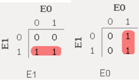

Por otro lado, la tabla de verdad correspondiente a las transiciones, donde E1 E0 es el estado inicial codificado, I es la entrada (0 ó 1) y S1 S0 el estado resultante codificado, queda de la siguiente manera:

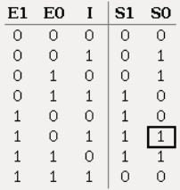

Con los mapas de Karnaugh siguientes:

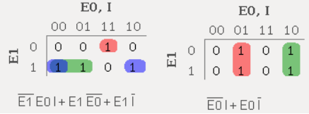

Generando así el circuito guardado en el archivo `modulo4.circ`

### Circuito Secuencia con traslape

Para este circuito se diseñó la siguiente máquina de estados finitos:
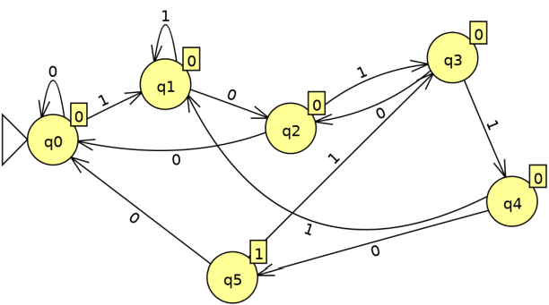

Donde:
Conjunto de Estados: {q0, q1, q2, q3, q4, q5}
Estado inicial: q0
Alfabeto de entrada: {0, 1}
Alfabeto de salida: {0,1}
Salidas: Cuadros de texto ubicados en el extremo superior derecho de cada estado
Transiciones: Flecha, indicando el sentido y el valor necesario para que ésta se realice

Con esta información, se creó la siguiente tabla de transiciones:

| Estado   | Alfabeto de salida   | Entrada: 0 | Entrada: 1   | 
|----------|----------------------|------------|--------------|
|   q0     |          0           |   q0       |     q1       |
|   q1     |          0           |   q2       |     q1       |
|   q2     |          0           |   q0       |     q3       |
|   q3     |          0           |   q2       |     q4       |
|   q4     |          0           |   q5       |     q1       |
|   q5     |          1           |   q0       |     q3       |

Y luego se codificó cada etiqueta de estado en notación decimal:

| Estado | E2 E1 E0 |
|--------|----------|
| q0     |  0 0 0   |
| q1     |  0 0 1   |
| q2     |  0 1 0   |
| q3     |  0 1 1   |
| q4     |  1 0 0   |
| q5     |  1 0 1   |

Después se realizó una tabla de equivalencias, a fin de verificar la existencia de estados redundantes. Este método consiste en inspeccionar qué condiciones deben cumplirse para que dos o más estados sean iguales, formando un sistema de ecuaciones. El criterio es el siguiente:
1. La salida de ambos estados deben ser iguales
2. El estado resultante al evaluar cada símbolo de entrada (0 y 1) debe ser igual al respectivo estado resultante del estado comparado

Así el sistema se desarrolla inductivamente hasta inspeccionar todos los estados, llegando a dos posibles soluciones:
1. Si hay dos o más casillas sin marcar, éstas son redundantes
2. Si todas las casillas están marcadas, ninguna casilla es redundante. Es decir, es el mínimo número de estados posibles para resolver el problema solicitado.

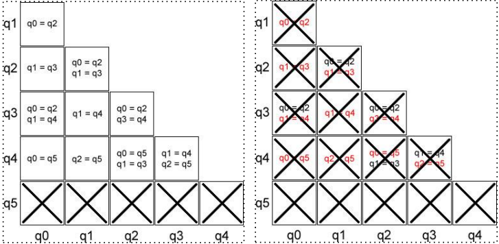

La solución es la siguiente:
Notamos que ningún estado puede ser igual a q5, dado que sólo q5 tiene como salida el valor 1 (por lo que no clasifica según el primer criterio), por lo que dichas casillas se marcan con una X, en señal de que no pueden ser equivalentes.

De forma similar, se descarta cada estado que tenga como condición que uno de sus estados siguientes sea igual a q5, por el motivo antes mencionado.

Inductivamente, llegamos a la conclusión de que no hay estados redundantes, dado que todas las casillas quedaron marcadas con una X.

Se han marcado en rojo las condiciones que no pueden cumplirse.

Por lo que se obtiene la siguiente tabla de verdad, donde E2 E1 E0 son los estados codificados y O son sus alfabetos de salida:

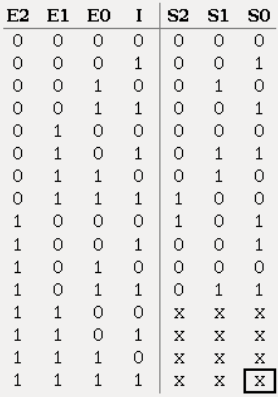

Y sus mapas de Karnaugh asociados son:

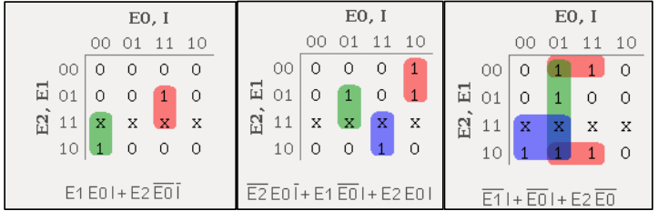

Finalmente se ha elaborado la tabla de verdad correspondiente a las transiciones, donde E2 E1 E0 es el estado inicial codificado, I es la entrada (0 ó 1) y S2 S1 S0 el estado resultante codificado, quedando de la siguiente manera:

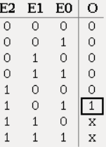

Con los mapas de Karnaugh siguientes:

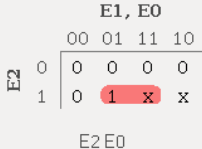

Generando así el circuito guardado en el archivo `secuencia10110traslape.circ`

